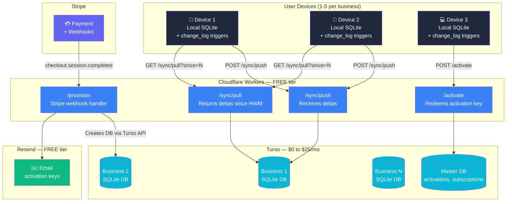
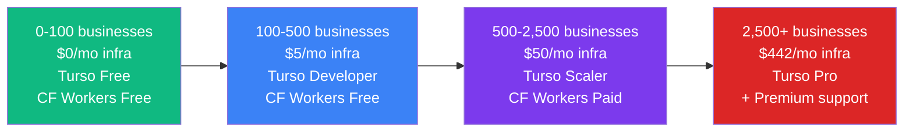
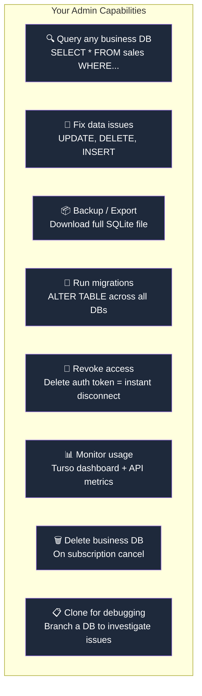
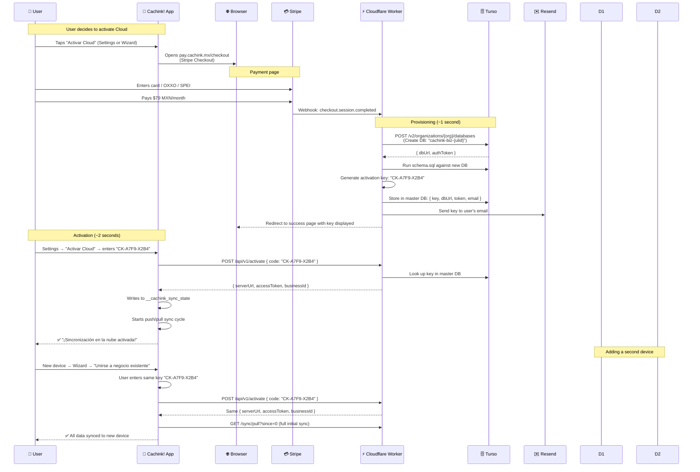
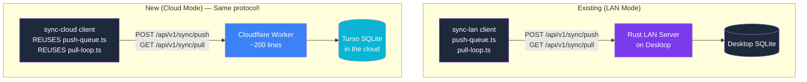

# Cachink! Cloud Mode — Implementation Plan

> **Status:** DRAFT — Pending approval
> **Created:** 2026-05-16
> **Authors:** Eduardo Torres, build.unosquare

---

## Table of Contents

1. [Executive Summary](#1-executive-summary)
2. [Architecture Overview](#2-architecture-overview)
3. [Why This Stack](#3-why-this-stack)
4. [Infrastructure Costs & Revenue Model](#4-infrastructure-costs--revenue-model)
5. [Scaling Path](#5-scaling-path)
6. [Database Management & Admin Control](#6-database-management--admin-control)
7. [User Experience Flow](#7-user-experience-flow)
8. [Technical Architecture](#8-technical-architecture)
9. [Implementation Phases](#9-implementation-phases)
10. [Risk Assessment](#10-risk-assessment)
11. [Open Questions](#11-open-questions)

---

## 1. Executive Summary

Cloud mode enables Cachink! businesses to sync data across 1-5 devices via the cloud. The architecture **reuses the existing LAN sync protocol** (push/pull/LWW) but points it at a serverless cloud endpoint instead of a local network peer.

**Key decisions:**
- **Drop PowerSync** ($49/mo saved) — overkill for 1-5 users per business
- **Use Turso** (SQLite in the cloud) — same format as local DB, $0-25/mo for thousands of businesses
- **Use Cloudflare Workers** (stateless sync API) — $0/mo on free tier, zero ops
- **Reuse `@cachink/sync-lan` protocol** — proven push/pull/LWW, already tested
- **Per-business isolated database** — you own and manage all DBs from your Turso account

**Total new code:** ~200 lines (Cloudflare Worker) + ~100 lines (app activation screen)

**Total infrastructure cost:** $0/mo for first 100 businesses, $5/mo for 100-500, $25/mo for 500+

---

## 2. Architecture Overview



---

## 3. Why This Stack

### Turso (Database) — Not Supabase, Not Neon

| Factor | Turso | Supabase | Neon |
|--------|-------|----------|------|
| **Free DBs** | 100 | 2 projects total | 1 project |
| **DB format** | **SQLite** (same as local!) | Postgres | Postgres |
| **Schema reuse** | 100% — same DDL, same Drizzle | Need Postgres translation | Need Postgres translation |
| **Provisioning** | Instant (<1s) | ~60 seconds | ~1 second |
| **Scale-to-zero** | All plans | Nano only (partnership) | All plans |
| **Cost at 500 businesses** | $25/mo | $25/mo shared OR impossible dedicated | $69/mo + need PowerSync |
| **Admin access** | Full — your account | Full | Full |
| **Sync engine needed** | No — reuse LAN protocol | Yes (PowerSync $49/mo) | Yes (PowerSync $49/mo) |

### Cloudflare Workers (API) — Not Vercel, Not Fly.io

| Factor | Cloudflare Workers | Vercel Edge | Fly.io |
|--------|-------------------|-------------|--------|
| **Free tier** | 100K requests/day | 100K/mo | None |
| **Cold starts** | None (V8 isolates) | Possible | None |
| **Global edge** | 300+ locations | ~20 regions | ~30 regions |
| **Ops burden** | Zero | Zero | Low (still a server) |
| **KV/storage** | Free tier included | Need separate DB | Need separate DB |
| **WebSocket support** | Yes (Durable Objects) | No | Yes |

### Why NOT PowerSync

PowerSync is designed for apps with thousands of concurrent users, complex partial sync, and real-time collaboration. Cachink! Cloud needs:
- 1-5 devices per business
- Total data per business: 5-50MB
- Sync frequency: a few times per day
- Conflicts: rare (small team, same business)

Your existing LAN sync protocol (push/pull/LWW with conflict surfacing) is **perfectly adequate** and already proven.

---

## 4. Infrastructure Costs & Revenue Model

### Fixed Costs by Scale

| Tier | Businesses | Turso | Cloudflare | Resend | Stripe | **Total cost** |
|------|-----------|-------|------------|--------|--------|---------------|
| Free tier | 0-100 | $0/mo | $0/mo | $0/mo | $0/mo | **$0/mo** |
| Growth | 100-500 | $5/mo (Developer) | $0/mo | $0/mo | $0/mo | **$5/mo** |
| Scale | 500-2,500 | $25/mo (Scaler) | $5/mo (paid) | $20/mo | $0/mo | **$50/mo** |
| Pro | 2,500+ | $417/mo (Pro) | $5/mo | $20/mo | $0/mo | **$442/mo** |

### Free Tier Limits (what you get for $0)

| Service | Free limit | Cachink! usage per business | Businesses supported |
|---------|-----------|---------------------------|---------------------|
| Turso | 100 DBs, 5GB storage, 500M reads/mo | ~10-50MB, ~10K reads/mo | **100** |
| Cloudflare Workers | 100K requests/day | ~20-50 req/day per business | **2,000+** |
| Resend (email) | 100 emails/day, 3K/mo | 1 email per activation | **3,000/mo** |
| Stripe | No monthly fee | 3.6% per transaction | **Unlimited** |

### Revenue Projections

**Pricing assumption:** $79 MXN/month (~$4.50 USD) per business — affordable for Mexican emprendedores.

| Businesses | Monthly revenue | Monthly cost | Stripe fees (3.6%) | **Net profit** | **Margin** |
|-----------|----------------|-------------|-------------------|---------------|-----------|
| 10 | $45 | $0 | $1.62 | **$43** | 96% |
| 25 | $113 | $0 | $4.05 | **$109** | 96% |
| 50 | $225 | $0 | $8.10 | **$217** | 96% |
| 100 | $450 | $0 | $16.20 | **$434** | 96% |
| 200 | $900 | $5 | $32.40 | **$863** | 96% |
| 500 | $2,250 | $50 | $81.00 | **$2,119** | 94% |
| 1,000 | $4,500 | $50 | $162.00 | **$4,288** | 95% |
| 2,500 | $11,250 | $442 | $405.00 | **$10,403** | 92% |

### Alternative Pricing Options

| Price point | MXN/month | USD/month | Break-even | Notes |
|------------|-----------|-----------|-----------|-------|
| Budget | $49 MXN | ~$2.80 | 0 businesses (free infra) | Very accessible, volume play |
| Standard | $79 MXN | ~$4.50 | 0 businesses | Recommended starting price |
| Premium | $149 MXN | ~$8.50 | 0 businesses | For businesses wanting priority support |
| Annual discount | $699 MXN/yr | ~$40/yr | 0 businesses | ~26% savings, better retention |

---

## 5. Scaling Path



### When to upgrade

| Trigger | Action | Cost change |
|---------|--------|-------------|
| 100th business signs up | Upgrade Turso Free → Developer ($5/mo) | +$5/mo |
| 5GB storage hit | Turso Developer → Scaler ($25/mo) | +$20/mo |
| 100K CF requests/day hit | CF Workers free → paid ($5/mo) | +$5/mo |
| 3,000 emails/month hit | Resend free → Pro ($20/mo) | +$20/mo |
| 2,500 businesses / compliance needs | Turso Pro ($417/mo) | +$392/mo |

### Data volume estimates

A typical Cachink! business generates:
- ~30 ventas/month × ~200 bytes = 6KB
- ~20 egresos/month × ~200 bytes = 4KB
- ~15 products × ~300 bytes = 4.5KB
- Misc (employees, clients, movements) = ~5KB
- **Total per business per month: ~20KB new data**
- **After 1 year: ~250KB per business**
- **5GB (Turso Free) supports: ~20,000 business-years of data**

Storage will never be the bottleneck. Read/write operations are the relevant limit, and at 1-5 devices syncing a few times per day, each business uses ~50-200 operations/day — trivial.

---

## 6. Database Management & Admin Control

### What you can do as the platform owner

Since ALL Turso databases live under YOUR Turso account, you have **full administrative control**:



### Specific admin operations

| Operation | How | When |
|-----------|-----|------|
| **View customer data** | Turso CLI: `turso db shell cachink-biz-{id}` | Customer support request |
| **Fix corrupted data** | Direct SQL against their Turso DB | Bug report |
| **Run schema migration** | Script that iterates all DBs via Turso API + runs ALTER TABLE | App update with schema change |
| **Revoke access** | Delete the activation record in master DB | Subscription cancelled / abuse |
| **Export customer data** | `turso db dump cachink-biz-{id} > backup.sql` | GDPR request / customer export |
| **Monitor health** | Turso dashboard shows per-DB metrics | Daily ops check |
| **Suspend a business** | Invalidate their auth token in master DB | Payment failed |
| **Transfer data** | Export from one DB, import to another | Business merges |

### Admin tooling (future, optional)

A simple admin dashboard (Cloudflare Pages + Workers) that lets you:
- List all businesses + their subscription status
- Search by activation key, email, or business name
- View sync stats (last push/pull timestamp, data volume)
- One-click "shell into DB" via Turso's HTTP API
- Bulk-run migrations
- Generate support exports

This is ~500 lines of code but NOT required for launch. The Turso CLI + dashboard covers day-one admin needs.

---

## 7. User Experience Flow

### Activation Flow (Happy Path)



### What the user sees in the app

**Step 1: Trigger** (Settings screen or Wizard)
```
┌─────────────────────────────────────────┐
│  ☁️  Sincronización en la Nube          │
│                                         │
│  Sincroniza tus datos entre todos tus   │
│  dispositivos automáticamente.          │
│                                         │
│  • Hasta 5 dispositivos                 │
│  • Respaldo automático                  │
│  • Acceso desde cualquier lugar         │
│                                         │
│  $79 MXN/mes                            │
│                                         │
│  [ Activar Cloud ]     [ Ya tengo clave ]│
└─────────────────────────────────────────┘
```

**Step 2: After payment** (success page in browser)
```
┌─────────────────────────────────────────┐
│  ✅ ¡Pago exitoso!                      │
│                                         │
│  Tu clave de activación:                │
│  ┌─────────────────────────┐            │
│  │  CK-A7F9-X2B4          │  📋 Copiar │
│  └─────────────────────────┘            │
│                                         │
│  También te la enviamos por correo a:   │
│  maria@correo.com                       │
│                                         │
│  Instrucciones:                         │
│  1. Abre Cachink! en tu dispositivo     │
│  2. Ve a Ajustes → Activar Cloud        │
│  3. Ingresa tu clave                    │
│                                         │
│  [ Abrir Cachink! ]  ← deep link        │
└─────────────────────────────────────────┘
```

**Step 3: Activation** (in-app)
```
┌─────────────────────────────────────────┐
│  🔑 Activar Cloud                       │
│                                         │
│  Ingresa tu clave de activación:        │
│                                         │
│  ┌─────────────────────────────────┐    │
│  │  CK-A7F9-X2B4                  │    │
│  └─────────────────────────────────┘    │
│                                         │
│  [ Activar ]                            │
│                                         │
│  ¿No tienes clave? Suscríbete arriba.   │
└─────────────────────────────────────────┘
```

**Step 4: Active state** (sync status badge in app shell)
```
  ☁️ Sincronizado · 2 dispositivos · hace 3 min
```

### Subscription Management

| Event | What happens |
|-------|-------------|
| **Payment succeeds** | DB provisioned, key emailed, cloud active |
| **Payment fails** | Stripe retries 3x. After all fail: grace period (7 days) |
| **Grace period expires** | Cloud sync pauses. Local data intact. "Renueva tu suscripción" banner |
| **User cancels** | Sync continues until period end. Then pauses. Data preserved 30 days |
| **30 days after cancel** | DB archived (downloadable backup). User can re-activate anytime |
| **User re-subscribes** | Same key works. Sync resumes from where it left off |

---

## 8. Technical Architecture

### Protocol Reuse

The key insight: your existing LAN sync protocol works unchanged for cloud.



**What's identical between LAN and Cloud:**
- Wire format (`Delta` schema with table, op, rowId, row, rowUpdatedAt, rowDeviceId)
- Push endpoint signature (`POST /api/v1/sync/push` with `{ deltas: Delta[] }`)
- Pull endpoint signature (`GET /api/v1/sync/pull?since=N&limit=500`)
- Response shapes (`PushResponse`, `PullResponse`)
- HWM tracking (localPushHwm, serverPullHwm)
- LWW conflict resolution (updated_at + device_id tiebreaker)
- Conflict surfacing (`__cachink_conflicts` table)
- Auth header (`Authorization: Bearer {token}`)

**What's different:**
- `serverUrl` points to `https://sync.cachink.mx` instead of `http://192.168.x.x:43812`
- No WebSocket (use periodic polling instead — cheaper, simpler for cloud)
- Auth token comes from activation key, not LAN pairing
- Server-side storage is Turso (remote SQLite) instead of local SQLite file

### Cloudflare Worker — Endpoint Specifications

#### `POST /api/v1/sync/push`

```typescript
// Receives deltas from a device, writes to the business's Turso DB
// Returns: { accepted, rejected, lastServerSeq }
// Auth: Bearer token (from activation)
// Body: { deltas: Delta[] } (max 500 per request)
```

**Server-side logic:**
1. Validate bearer token → look up Turso DB URL for this business
2. For each delta: INSERT INTO `__cloud_change_log` (server-side log)
3. For each delta: LWW upsert into the entity table (same logic as pull-loop.ts `buildUpsertLww`)
4. Return accepted/rejected counts + new server seq

#### `GET /api/v1/sync/pull?since=N&limit=500`

```typescript
// Returns deltas since the given HWM that did NOT come from this device
// Returns: { deltas, nextSince, hasMore }
// Auth: Bearer token
// Query: since (number), limit (number, max 500)
```

**Server-side logic:**
1. Validate bearer token → look up Turso DB URL
2. `SELECT * FROM __cloud_change_log WHERE id > ? AND device_id != ? LIMIT ?`
3. Return deltas + pagination info

#### `POST /api/v1/activate`

```typescript
// Redeems an activation key, returns connection credentials
// Body: { code: "CK-A7F9-X2B4", deviceId: "01HXYZ..." }
// Returns: { serverUrl, accessToken, businessId }
```

#### `POST /webhook/stripe`

```typescript
// Stripe webhook — provisions a new business on payment
// Validates Stripe signature
// Creates Turso DB, stores activation record, sends email
```

### Database Schema (Turso — per-business DB)

Same as local SQLite schema (from `packages/data/drizzle/migrations/`) PLUS one extra table:

```sql
-- Additional table for cloud: server-side change log
CREATE TABLE IF NOT EXISTS __cloud_change_log (
  id INTEGER PRIMARY KEY AUTOINCREMENT,
  table_name TEXT NOT NULL,
  row_id TEXT NOT NULL,
  op TEXT NOT NULL CHECK (op IN ('insert', 'update')),
  device_id TEXT NOT NULL,
  row_data TEXT NOT NULL,  -- JSON-encoded full row
  row_updated_at TEXT NOT NULL,
  created_at TEXT NOT NULL DEFAULT (datetime('now'))
);

CREATE INDEX idx_cloud_changelog_device
  ON __cloud_change_log(device_id, id);
```

### Master Database Schema (one Turso DB for platform operations)

```sql
CREATE TABLE activations (
  id TEXT PRIMARY KEY,           -- ULID
  code TEXT NOT NULL UNIQUE,     -- "CK-A7F9-X2B4"
  business_id TEXT NOT NULL,     -- ULID
  business_name TEXT NOT NULL,
  email TEXT NOT NULL,
  turso_db_name TEXT NOT NULL,   -- "cachink-biz-{ulid}"
  turso_db_url TEXT NOT NULL,    -- "libsql://cachink-biz-xxx.turso.io"
  turso_auth_token TEXT NOT NULL,
  stripe_customer_id TEXT,
  stripe_subscription_id TEXT,
  status TEXT NOT NULL DEFAULT 'active',  -- active, paused, cancelled, archived
  max_devices INTEGER NOT NULL DEFAULT 5,
  created_at TEXT NOT NULL,
  expires_at TEXT              -- NULL = never expires (while subscription active)
);

CREATE TABLE devices (
  id TEXT PRIMARY KEY,           -- device ULID
  activation_id TEXT NOT NULL REFERENCES activations(id),
  device_name TEXT,
  last_push_at TEXT,
  last_pull_at TEXT,
  created_at TEXT NOT NULL
);

CREATE INDEX idx_activations_code ON activations(code);
CREATE INDEX idx_activations_email ON activations(email);
CREATE INDEX idx_activations_stripe ON activations(stripe_subscription_id);
CREATE INDEX idx_devices_activation ON devices(activation_id);
```

### File Structure (new code)

```
workers/
└── sync-cloud/
    ├── wrangler.toml            # Cloudflare Worker config
    ├── package.json             # Dependencies: hono, @libsql/client, stripe
    ├── src/
    │   ├── index.ts             # Router (Hono) — ~30 lines
    │   ├── push.ts              # POST /sync/push — ~50 lines
    │   ├── pull.ts              # GET /sync/pull — ~40 lines
    │   ├── activate.ts          # POST /activate — ~30 lines
    │   ├── provision.ts         # POST /webhook/stripe — ~50 lines
    │   ├── auth.ts              # Bearer token validation — ~20 lines
    │   ├── turso.ts             # Turso client factory — ~20 lines
    │   └── schema.sql           # Per-business DB schema (reuse from data/)
    └── tests/
        ├── push.test.ts
        ├── pull.test.ts
        └── activate.test.ts
```

**Total new backend code: ~240 lines**

### App-Side Changes

| File | Change | Lines |
|------|--------|-------|
| `packages/ui/src/screens/CloudActivation/` | New screen: key entry + activation | ~100 |
| `packages/ui/src/sync/cloud-sync-client.ts` | Thin wrapper: reuses LAN push/pull with cloud URL | ~50 |
| `packages/data/src/sync-state.ts` | Add 2 new scopes: `cloud.serverUrl`, `cloud.accessToken` | ~5 |
| `packages/ui/src/screens/Settings/` | Add "Activar Cloud" card | ~20 |
| `packages/ui/src/screens/Wizard/state.ts` | Add `'cloudActivate'` step | ~5 |

**Total app-side new code: ~180 lines**

---

## 9. Implementation Phases

### Phase C1 — Cloudflare Worker + Turso Provisioning (Backend)

**Goal:** Deploy a working cloud sync server that handles push/pull.

1. Create `workers/sync-cloud/` project with Wrangler
2. Set up Turso account + master database
3. Implement `/webhook/stripe` (provision DB on payment)
4. Implement `/activate` (redeem key, return credentials)
5. Implement `/sync/push` (receive deltas, LWW upsert)
6. Implement `/sync/pull` (return deltas since HWM)
7. Implement bearer token auth middleware
8. Deploy to Cloudflare Workers
9. Configure Stripe webhook endpoint
10. Test end-to-end: payment → provision → push → pull

**Dependencies:** Stripe account, Turso account, Cloudflare account, Resend account
**Estimated effort:** 2-3 days

### Phase C2 — App Integration (Activation + Sync Client)

**Goal:** Users can enter a key and start syncing.

1. Create `CloudActivationScreen` (key entry UI)
2. Create `cloud-sync-client.ts` (wraps existing push/pull with cloud URL)
3. Add `cloud.serverUrl` and `cloud.accessToken` scopes to sync-state
4. Wire activation screen into Settings and Wizard
5. Start push/pull loop when cloud credentials are present
6. Update `SyncStatusBadge` to show cloud sync state
7. Test: activate → push data → pull on second device

**Dependencies:** Phase C1 deployed
**Estimated effort:** 2-3 days

### Phase C3 — Subscription Lifecycle

**Goal:** Handle payment failures, cancellations, reactivations.

1. Implement Stripe webhooks: `invoice.payment_failed`, `customer.subscription.deleted`
2. Add grace period logic (7 days after payment failure)
3. Add "subscription paused" state in app (banner, no sync, data preserved)
4. Add "re-activate" flow (same key, resume sync)
5. Add 30-day archival (backup DB, delete active instance)
6. Test all lifecycle states

**Dependencies:** Phase C2 complete
**Estimated effort:** 1-2 days

### Phase C4 — Polish + Multi-Device

**Goal:** Smooth multi-device experience.

1. Track device count per activation (max 5)
2. Show connected devices list in Settings
3. Allow "remove device" from any device
4. Add periodic sync (every 5 minutes when app is foreground)
5. Add "sync now" manual trigger
6. Add "last synced" timestamp display
7. Maestro E2E flow for cloud activation

**Dependencies:** Phase C3 complete
**Estimated effort:** 2-3 days

### Phase C5 — Admin Tooling (Optional, Post-Launch)

**Goal:** Simple admin dashboard for customer support.

1. Cloudflare Pages site (admin.cachink.mx)
2. List businesses + subscription status
3. Search by email/key/business name
4. View sync stats per business
5. One-click DB shell (via Turso HTTP API)
6. Bulk migration runner

**Dependencies:** Phase C4 launched
**Estimated effort:** 3-5 days (not blocking launch)

---

## 10. Risk Assessment

| Risk | Severity | Probability | Mitigation |
|------|----------|-------------|------------|
| Turso changes pricing | Medium | Low | At $25/mo Scaler you're already very safe. Turso is Databricks-backed (acquired 2025). Worst case: migrate to Cloudflare D1 (same SQLite format) |
| Cloudflare Workers limits | Low | Low | 100K req/day = thousands of businesses. If hit, paid plan is $5/mo |
| Turso free tier removed | Medium | Low | Developer plan is $5/mo — trivial cost. Migration is zero-effort (just upgrade plan) |
| Conflict resolution too simple | Low | Low | LWW works great for 1-5 users in same business. If needed later, add CRDT columns |
| User loses activation key | Low | High | Always stored in master DB. "Reenviar clave" button re-sends email. Support can look it up |
| Stripe OXXO 24-48h delay | Low | Medium | Show "Pago pendiente" state. Provision DB only after payment confirms. Email key when confirmed |
| Schema migrations across N DBs | Medium | Medium | Script iterates all Turso DBs via API. Run ALTER TABLE on each. Batch with retries |
| Data volume exceeds Turso limits | Low | Very Low | At 250KB/business/year, you'd need 20,000 business-years to fill 5GB. Non-issue |

---

## 11. Open Questions

- [ ] **Pricing:** $49 MXN, $79 MXN, or $99 MXN per month? Or offer both monthly and annual?
- [ ] **OXXO support:** Include OXXO as payment method? (adds 24-48h provisioning delay)
- [ ] **Deep links:** Should "Abrir Cachink!" button on success page auto-fill the key via deep link?
- [ ] **Device limit:** 5 devices per business, or make it configurable per plan?
- [ ] **Grace period:** 7 days or 14 days after payment failure?
- [ ] **Data retention:** 30 days or 90 days after cancellation before archiving?
- [ ] **Domain:** `sync.cachink.mx` for the Worker, or `api.cachink.mx`?
- [ ] **Admin dashboard:** Build for launch, or use Turso CLI initially?
- [ ] **Existing sync-cloud package:** Deprecate the PowerSync-based `@cachink/sync-cloud`, or keep it as a "premium" BYO option?

---

## Summary

| Aspect | Value |
|--------|-------|
| **New backend code** | ~240 lines (Cloudflare Worker) |
| **New app code** | ~180 lines |
| **Infrastructure cost (0-100 businesses)** | $0/month |
| **Infrastructure cost (100-500 businesses)** | $5/month |
| **Infrastructure cost (500+ businesses)** | $25-50/month |
| **Revenue per business** | $4.50 USD/month ($79 MXN) |
| **Margin** | 92-96% |
| **Time to implement** | ~7-10 days (Phases C1-C4) |
| **Ops burden** | Zero (fully serverless) |
| **Admin control** | Full (all DBs in your Turso account) |
| **Protocol reuse** | 100% (same push/pull/LWW as LAN) |
